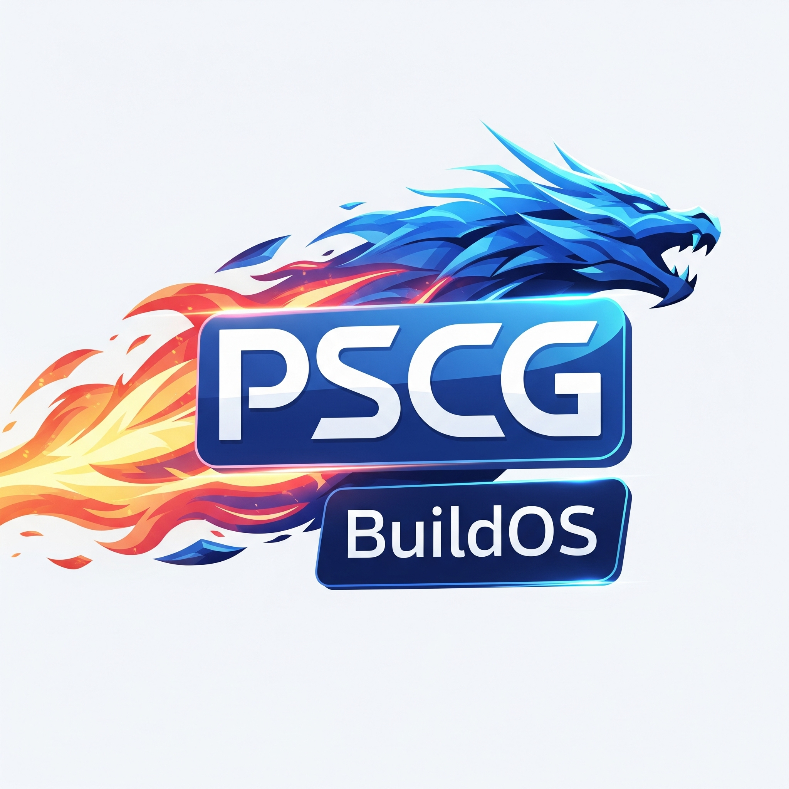

<p align="center">
  
</p>

# PSCG BuildOS
**PSCG BuildOS** is a comprehensive set of tools that build fully fledged *Linux* products, and helps in both building helpful and often necessary products and concepts  *very* fast, and in running them on different hardware and emulators, supporting virtually every possible architecture and [likely not in what you see publicly] non Linux operating systems.

The system has been built by *Ron Munitz*, to support his seminal Embedded Linux/Android internals research, development, and training work, under *The PSCG* and other famous, and less famous organizations.
This publicly open sourced version is an effort to bring free resources to a wide audience of trainees, conference talks attendees, and curious and hard working minds.

While there has been attempt to omit references to non published work, there might be such. You are welcome to help and change that, this project is no longer "mine" - it is ours!

Numerous videos have been uploaded to [this youtube playlist](https://www.youtube.com/playlist?list=PLBaH8x4hthVysdRTOlg2_8hL6CWCnN5l-) and videos are uploaded from time to time, especially around public talks, so you are welcome to subscribe and stay tuned for updates there.

Very important and extensive documentation sources:
- The source itself is **highly** documented, with design principles, reasons for doing things, extra credit exercises and more.
- The [Documentation](Documentation/) folder has very specific and helpful documentation, as well as porting guides.
  If you build Linux you should at least read following files:
  - [README.arch.md](Documentation//README.arch.md) - top level architecture variables explanation, and an example of porting the Linux build to another architecture
  - [README.linux.md](Documentation/README.linux.md) - Linux specific distro design and porting

  It is highly recommended to read everything else under the [Documentation](Documentation/) folder if you intend to work seriously with the platform (and/or contribute to the project).

## Building and running - quick getting started guide
### Preparing your host
There are a lot of configuration options and additional layers. Some are explained in the videos, some in additional projects, and a lot of things in the code itself.
The published versions is meant to run on *Ubuntu* or *Debian* hosts (for all means, you can use docker containers for such - but they will need to have the capabilities to work with loopback devices) and before releasing the open source project it has been mostly tested on:
* Ubuntu 25.10 - recommended if you wish to build for *loongarch* architectures without taking care of toolchains yourself.
* Ubuntu 24.04  

Since the closed sourced project users mostly aim towards not being wasteful in disk space, and *The PSCG* training courses often require buiding the toolchains as part of the courses,
it is quite impossible to provide one *Dockerfile* or setup instructions that will suit all. We therefore added in this project a list of (*Debian*) setup steps, that are expected to be used if you are already set up for building the *Linux kernel*. 

Then, to install distro provided default toolchains (that you don't need if you have your own in your `PATH` and set `CROSS_COMPILE` before building ), and obtain necessary and additional projects that either give some more examples of using this build-system ([PscgBuildOS-helpers](https://github.com/ronpscg/PscgBuildOS-helpers)), provide additional layers (e.g. [PscgBuildOS-extra-layers](https://github.com/ronpscg/PscgBuildOS-extra-layers)), or provide other required projects (e.g. [e2fsprogs-static-builds](https://github.com/ronpscg/e2fsprogs-static-builds) , [linux-firmware](https://git.kernel.org/pub/scm/linux/kernel/git/firmware/linux-firmware.git) and more) run `./setup/first-setup.sh`.

### Building and running example
The main build script is `build-image.sh`. Since the build system allows for *lots* of configuration options, when you learn how to use it, you will most likely use your own wrapper scripts, or environment variable files. [PscgBuildOS-helpers](https://github.com/ronpscg/PscgBuildOS-helpers) provides some solid examples for this, and it is absolutely recommended for you to familiarize yourself with them.

An example for building a *pscg_busyboxos* distro for *x86_64* based *QEMU* device without any additional wrapper scripts:
```
config_distro__reuse_shared_src=true config_distro__reuse_shared_arch=true config_kernel__autoadd_tricky_and_required_config_items=true ARCH=x86_64 config_distro=pscg_busyboxos ./build-image.sh
```

There are some system defaults involved, so in this case, you would want to look at the last output lines. At the time of writing, the defaults are:
- Create an installer media
- Do not create a livecd media (but the output tells you how to do it yourself)
- Do not create a storage media

So we will create a storage media:
```
dd if=/dev/zero of=/tmp/storage.img bs=1G count=2
```
and demonstrate the installation to it by doing, by using it (a custom path) and waiting for the removable media (otherwise - the system aims to run something at a yet non existing *system* partition):
```
CMDLINE=waitforremovablemedia EMMC_IMAGE_FILE=/tmp/storage.img /home/ron/PscgBuildOS/out/artifacts/runqemus/pscg_busyboxos-x86_64/run-qemu.sh
```

Then, we will follow the output of the procedure, and do exactly what is written if the flashing is successful - i.e. remove the media and install:
```
# keyboard: ctrl a+x  # exit QEMU
EMMC_IMAGE_FILE=/tmp/storage.img /home/ron/PscgBuildOS/out/artifacts/runqemus/pscg_busyboxos-x86_64/run-qemu.sh
```


## Understanding top layer examples and concepts

### Coding conventions
Styling, and general:
- Logging functions, and functions that are strictly related to the build system itself, are marked in *camelCase*
	- The exception is `add_layer`
- Logging and doing functions, are marked in *snake_case*	
- Important project wise global variables are marked with *UPPER CASE*
  - This is subject to modification. For example - `BUSYBOX_INSTALL_DIR` is used by some components, but could be moved to `busybox_install_dir`. The capital cases just stand more to the eye. Most of the other `BUSYBOX_...` variables do not interest anyone outside of the *busybox* project
- Global configuration variables and functions are usually marked with *snake_case*

More Conventions:
- A *subsystem*, *layer* or *distro* specific variables and functions which are meant to be available for external components *may* be prefixed with the component name, followed by a double underscore (`__`) , e.g. `pscg_debos__some_specific_function. Otherwise, each local compoment or recipe or shell script may opt for shorter naming conventions.
- If something is not unique - it may be overriden. Then, the order of sourcing is significant
- While all of the overridable variables have default values, some variables are expected to be configured externally (e.g. `distro`, `ARCH`, to name a few). They will necessarily be defined in a `.buildconfig` file.
- A variable that may be customizable by the external environment (prior to calling `build-image.sh`) is prefixed by `config_`. Most of these variables will have overridable default values (e.g. : `${config_somecomponent__somevar=somevalue}`)
  - Other variables may also be set externally, if they are defined with overridable default - but that is not welcome, and broadly meant for build system configuration only.

Yet more conventions:
- Scripts that are meant to be *called* and not *sourced* are expected to have the following pattern:
	```
	main() {
		... #								# script logic goes here
	}

	commonScriptPrologue 					# announces script and sets LOCAL_DIR
	export logTag=$(basename $LOCAL_DIR)	# may want to put it in inner or more outer scope
	cd $LOCAL_DIR							# start working at the script directory. This is not necessary for all scripts, but can be useful for some
	main $@									# call the main function
	commonScriptEpilogue					# just say we're done and change directory to what it was proir to executing this script
	```
- Variable exporting is explicit whenever possible. Sometimes, it is done with:
	```
	export -a
	...
	: ${somevar=somevalue}
	export -a
	```
	The main reason to do so is to save typing/too many export lines, and prevent the user from setting up an environment variable and forgetting to export it when needed, while still allowing customizations.

- You will sometimes find the word *devhack* - it is usually used to save a lot of time for either typing/setting up a lot of environment variables, or implementing some things just to speed up things (at build time).
For example, `config_busybox__allow_useprevbuild_devhack`


Note: a lot of things were just hacked and migrated from all kind of training and work sources (all written by Ron Munitz (i.e me), so no copying, maybe from myself...). As this is a self use project that has been used
extensively on training, and some terminologies have changed at some times, or code modifications could be subtle, the conventions are not orthodox.

Some things are just used the way they are in a lot of my projects, and I like using them that way (e.g. fatalError), as they stand out. Naturally if this project is used by others, I will be happy to
accept contributors (as long as they are rigorous testers)

### build/
- `commonEnv.sh` - common functions used by the build system, such as logging events, macros,
- `commonFolders.buildconfig` - definitions of common toplevel folders, such as `LAYERS_DIR` and `DISTROS_DIR`, to which one could add *layers*, and *distros* even out of tree.

As opposed to the *Yocto Project*, a *distro* is not (exactly) a layer. A distro actually refers to a logical grouping that represents a Linux distro that would resemble one of the popular desktop distros, a minimal one,
or a non Linux distro.
This helps in presenting concepts to people that are not familar with the Yocto Project which has terminologies that years of teaching experience show are not easy to grasp or fully "assimilate" until one has some decent Embedded Linux mileage.

- `base_fetch_unpack.sh` defines functions to handle generic *fetching* and *unpacking* of source code, and possibly binaries from either a tarball, or a git repository.
  - Each component may call some of the functions that are defined in this file, to achieve common goals, and may add its own logic, and/or specify the paramters for the common methods
  - As the comment in the file says:
    - the *exported* functions ()`base_do_fetch()`, `base_do_unpack()`) are to be called
    - the exported variables (`base_fetch_git`, `base_unpack_git`, `base_fetch_tarball`, `base_unpack_tarball`) are to be configured prior to calling them (E.g. in each *distro's* `do_fetch()` and `do_unpack()` functions)

### config/
Top level configuration files
- `buildtasks.buildconfig` defines which tasks (e.g. `config_buildtasks__do_build_rootfs`, `config_buildtasks__do_build_kernel`, etc.)  to do on this build.\
This can be used to build specific components of the image and skip others, for build speedup.
- `toplevel.buildconfig` defines variables that affect the *build caches* and *downloads* directories, where to look for common *prebuilts*, whether to build *offline* or not, whether to rebuild from *scratch* or incrementally from the last build, etc.
- `toplevel.arch.buildconfig` defines the `architecture` and `subarchitecture` (which is a simplifcation, in a way), andjusts the right variables for `ARCH` and `CROSS_COMPILE` if needs be.\
See [README.arch.md](Documentation/README.arch.md) for more details

### distros/
Scripts and configuration files to build distros:
- `common` - common scripts and configurations for all types of distros (not just *Linux*)
- `common-linux` - common scripts and configurations for *Linux* based distros
- `pscg-busyboxos` - The simplest and leanest distro. Runs something very similar to the ramdisk, as a separate root filesystem (rootfs)
- `pscg-debos` - A *Debian* based distro, from either *Debian* or *Ubuntu* repos. Relies on `debootstrap`.
  - There are other means to bootstrap a *Debian* based root filesystem
- `pscg_quickhack_linuxos` - enables to show quick additions to a base distro
- `pscg_alpineos` - An *Alpine* based distro

Essentially, one can just get a rootfs from another distro (e.g. *Yocto Project*, *AOSP*, or anything else), and create another distro of their own for it. They can also use all kind of clever configuration reusing options, which are listed in  `.buildconfig` files

### layers/
This is where adding functionalities, and specific software and firmware pacakge configuration is applied. A *layer* is added to the build, by calling the `add_layer()` function (see [commonEnv.sh](build/commonEnv.sh)) which calls a dedicated `add-layer.sh` script in the added layer directory.

Some of the layers, hold configuration only, and they are referred to by some recipes in other layers. 

The *bsp* layers are defined in a way that define the kernel default configurations for qemu based BSP for different archietectures. The `bsp` has been organized as a layer, because that is how it's done in *OpenEmbedded* (and therefore the *Yocto Project*), and when real BSP's are concerned, usually the pros will either port it (or its artifacts) from the `Yocto Project`, or port from here to the *Yocto Project*

The key topic in the layers are the definitions of *recipes*, which are build files that instruct how
to do some tasks.

A (partial) list of layers (will likely not be updated):
- `bsp` - QEMU kernel configuraion for each architecture. **TODO change bsp names**
  can be used to add other machine specific BSP's, although those are likely available through external repos
- `common` - recipes for common tasks (all of them are related to *Linux*) but they don't have to be so.\
Under `recipes` you will find recipes for:
  - `busybox` - building busybox
  - `examples` - some examples in several domains such as
  - `image` - preparing the image, and installer, and OTA/recovery/etc. mechanisms etc.
  - `initramfs` - Utilizing `busybox` and other prebuilts, building an initramfs that implements the logic for *booting the operational rootfs properly`, `flashing a new image`, `recovering a "golden recovery image"`, `applying an OTA update` and more.

  This recipes is instrumental in teaching some of the most important and hardest to implement *Embedded Linux* tasks - without requiring any particular bootloader. For educational purposes,
  it is great. (of course that for making a secure and close to perfect device, hardware specific, and bootloader specific mechanisms are required)
- `pscg_debos` Has specific layers to achieve all kind of tasks, specific to Debian based systems, mostly utilizing the `apt` package manager, and populating configuration files.

You will find more layers with examples and the addition of other important components and subsytems in the [PscgBuildOS-extra-layers](https://github.com/ronpscg/PscgBuildOS-extra-layers) project. Once you familiarize yourself with the contents, you can proceed and add your own layers.

## Videos (partial list)
Some videos from 2024:
- https://www.youtube.com/watch?v=WirNfHM9mec&list=PLBaH8x4hthVysdRTOlg2_8hL6CWCnN5l-&index=40 - overall concepts and working with `pscg_quickhack_linuxos` to build an Alpine rootfs, reuse materials etc.
- https://www.youtube.com/watch?v=z5knWzLTGt8&list=PLBaH8x4hthVysdRTOlg2_8hL6CWCnN5l-&index=42 - the pscg_alpineos layer - organized and separated (v3.19 - the versions were updated in 2025)

# License & Attribution

This project is licensed under the Apache License 2.0 with an additional attribution requirement.  
You must retain the attribution to "Ron Munitz" in any copies or derivative works.  

See the LICENSE and NOTICE files for details.
